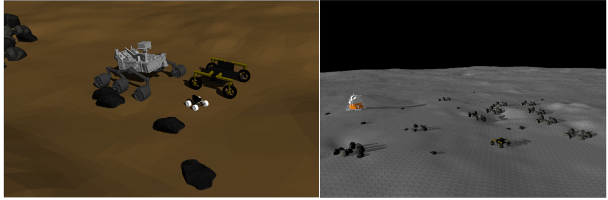

Implementation of a simulation API for Mars and Moon terrain with a skid steering (Pathfinder) and 4WS (Moontamer) rover

<p align="center">

</p>


if you face an error about four_wheel_steering_msgs after catkin_make, run

```
rosdep install --from-paths src --ignore-src -r -y
```
To launch the Moontamer rover in Gazebo (Moon environment)
```
roslaunch moontamer_gazebo empty_world.launch
```

To drive the Moontamer rover, you can use a joystick, or simply
```
rostopic pub /joy_teleop/cmd_four_wheel_steering four_wheel_steering_msgs/FourWheelSteering "{front_steering_angle: 0.0, rear_steering_angle: 0.0, front_steering_angle_velocity: 0.0,rear_steering_angle_velocity: 0.0, speed: 0.0, acceleration: 0.0, jerk: 0.0}" -r10
```
With above rostopic pub command, you can change the steering angles, and speed of the rover. The rover is capable of doing Ackermann, skid steering, holonomic, and crab-walk driving.
